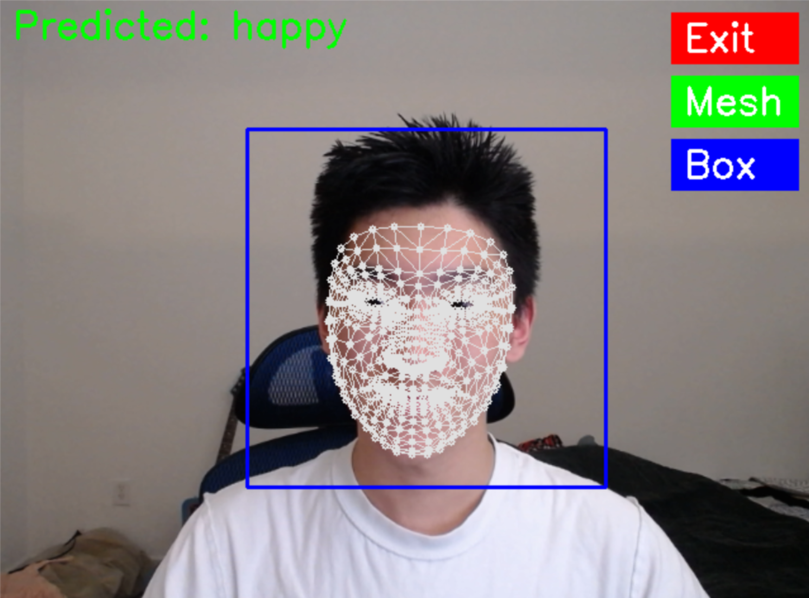

# Facial Expression Recognition System Using Machine Learning

## Project Overview

Facial expressions are essential to human communication. In this project, we developed a machine learning-based facial expression recognition system that identifies emotions in real time. Leveraging both image data and facial landmarks, the system is capable of analyzing live video input and static images. It has potential applications in human-computer interaction, virtual avatars, education, and more.

### Showcase


## Authors

- **Waiyuk Kwong** – Implement Model, Preprocessing pipeline , Data Visualization, real-time detection
- **Zhihui Chen** – Model evaluation, Streamlit implementation & debugging  
- **Tyler Lin** – Streamlit development & debugging  
- **Blane R. York** – Slide creation, file management  
- **Carter D. Robinson** – UI for capture/upload windows, emotion prediction interface

## Technical Stack

- **Dataset**: FER-2013 ([Kaggle](https://www.kaggle.com/datasets/msambare/fer2013))
- **Libraries**: PyTorch, OpenCV, MediaPipe, Streamlit, Scikit-learn
- **Models Used**:  
  - Random Forest (on facial landmarks)  
  - Support Vector Machine (on facial landmarks)  
  - Convolutional Neural Network (on raw images; fine-tuned ResNet18)

---

## System Architecture

### Data Preprocessing

- **Facial Key Point Extraction**: Using MediaPipe, we extract 468 facial landmarks to capture geometric features.  
- **Image Normalization**: Standardizes image pixel values to reduce lighting and contrast inconsistencies.  
- **Data Augmentation**: Rotation, flipping, cropping, color jittering to expand dataset and improve generalization.

### Model Training

- **CNN (ResNet18)**: Fine-tuned on FER-2013 with early stopping and learning rate scheduling.  
- **Random Forest / SVM**: Trained on keypoint features extracted via MediaPipe.

### UI Applications

- **Capture Window** (`capture_window.py`): Real-time facial emotion recognition via webcam.  
- **Upload Window** (`upload_window.py`): Detect emotion from static images.  

---

## 📊 Model Performance Summary

| Model           | Accuracy | F1 Score |
|----------------|----------|----------|
| Random Forest  | 40.07%   | 0.37     |
| SVM            | 50.28%   | 0.48     |
| CNN (ResNet18) | **71.39%** | **0.712** |

> ✅ The CNN model significantly outperformed RF and SVM thanks to visual feature learning and augmentation.

---

## File Structure

```bash
/archive/                 
  ├── train/              # Training images
  └── test/               # Testing images

/data_processing_method/  
  ├── cnn_image_processing_pipeline.py  
  ├── data_augmentation.py  
  ├── face_mesh_module.py  
  ├── image_normalization.py  
  └── image_processing_pipeline.py  

/evaluation/              
  ├── evaluation_cnn.py  
  ├── evaluation_rf.py  
  └── evaluation_svm.py  

/ml_model/                
  ├── cnn_model.pth  
  ├── svm.zip (unzip before use)  
  └── rf.zip (unzip before use)  

/train/                   
  ├── train_cnn_model.py  
  ├── train_rf_model.py  
  └── train_svm_model.py  

/UI/                      
  ├── capture_window.py  
  ├── upload_window.py  
  └── helper/             
      ├── emotion_model.py  
      ├── face_detection.py  
      ├── face_mesh.py  
      └── utils.py  

/views/                   
  └── final_report.py     # Streamlit app (main report interface)
```

---

## Setup Instructions

### 1. Install Git LFS

This repository contains large model files. You must install **Git LFS** before cloning the repository:  
🔗 https://git-lfs.com/

### 2. Clone the Repository

```bash
git clone <your_repo_url>
```

### 3. Unzip Model Files

Navigate to the `/ml_model/` directory and unzip the following files:

- `svm.zip`
- `rf.zip`

> **Note**: Ensure that the unzipped model files remain in the `/ml_model/` directory.

### 4. Install Dependencies

Install required Python packages:

```bash
pip install -r requirements.txt
```

### 5. Run the Streamlit App

To launch the main UI and report interface:

```bash
streamlit run final_report.py
```

---

## Final Report Summary

This project implements a **hybrid facial expression recognition system** using both **geometric keypoint features** and **visual image features**. Three models were evaluated and compared: **Random Forest**, **Support Vector Machine**, and a **Convolutional Neural Network (CNN)** based on ResNet18.

### 🔍 Key Observations

- **CNN** achieved the best performance with **71.39% accuracy** and **F1-score of 0.712**
- **Class imbalance** (e.g., many "happy" samples, few "disgust") introduced prediction bias
- The **48x48** resolution of FER-2013 limits ability to detect subtle emotion differences
- CNN benefits greatly from **data augmentation** and **advanced preprocessing**

---

### 📈 Performance Charts (Available in `streamlit/`)

- Confusion matrices  
- Training & validation accuracy/loss  
- Class distribution for each model  

You can view all visualizations by running:

```bash
streamlit run final_report.py
```
---

## Gantt Chart

  
📅 [Google Sheets Gantt Chart](https://docs.google.com/spreadsheets/d/16sWj1XushsbAo5WwqrAq6MPuiGra0VFZrKK61rONgeo/edit?usp=sharing)
